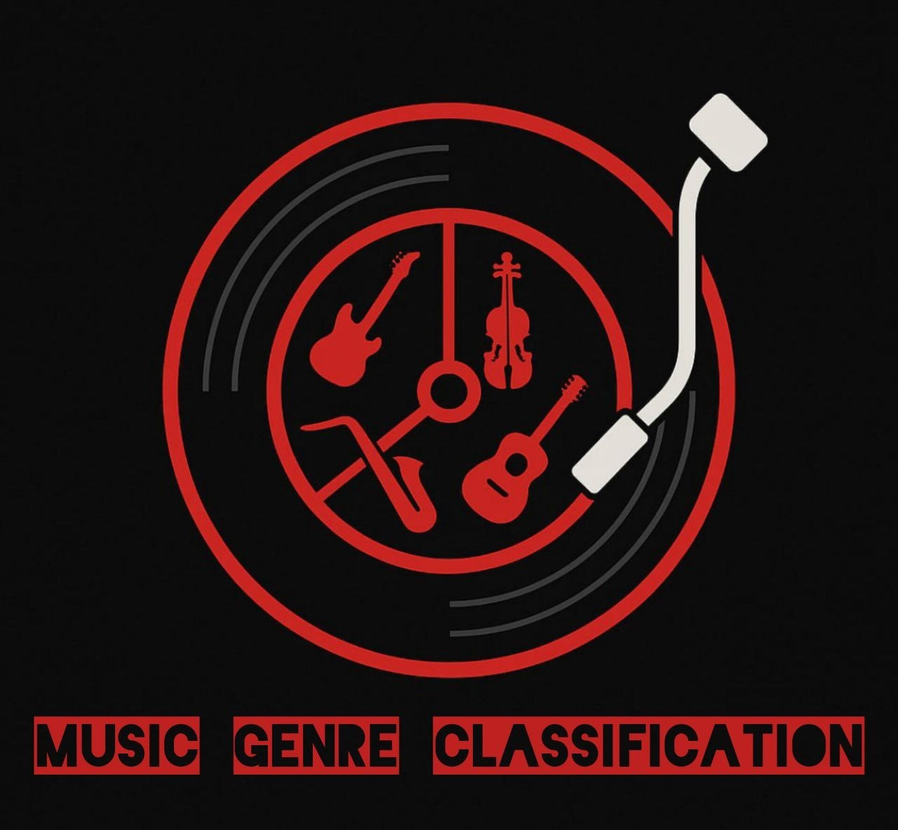

<p align="center">
  
</p>

# Music Genre Classification (CNN + MFCC)

This project is a **Music Genre Classification system** built with **Python, TensorFlow/Keras, and Librosa**.  
It supports two approaches:
- **MFCC-based model** (simple dense network using extracted features).
- **CNN-based model** (deep VGG-style Convolutional Neural Network on Mel-spectrograms).

The project can train on the **GTZAN dataset** (10 genres) or any custom dataset with the same folder structure.

---

## Project Structure
 ```bash
music_genre_classification/
│
├── main.py # Entry point (train/evaluate/predict)
├── requirements.txt # Dependencies
├── src/ # Source code
│ ├── data.py # Dataset preparation (MFCC + spectrograms)
│ ├── train.py # MFCC training
│ ├── train_cnn.py # CNN training
│ ├── evaluate.py # Model evaluation
│ ├── predict.py # Predict genre for a given file
│ └── config.py # Label encoder and configs
└── models/ # Saved models (.keras)
 ```

---

## Installation

1. Clone the repository:
   ```bash
   git clone https://github.com/Danial-k-f/Music-Genre-Classification.git
   cd Music-Genre-Classification
---
- Install dependencies
```bash
pip install -r requirements.txt
```
---
## Usage
1. Train a model

###CNN model (spectrograms):

```bash
python main.py --mode cnn
```

###MFCC model:

```bash
python main.py --mode mfcc
```
---
2. Predict a genre

Provide a .wav file (e.g., data/sample.wav):
```bash
python main.py --mode cnn --predict data/sample.wav
```
---
## Dataset

The project was tested on the GTZAN dataset (10 genres, 1000 samples).
Dataset folder structure:

data/gtzan_dataset/genres/
    ├── blues/
    ├── classical/
    ├── country/
    ├── disco/
    ├── hiphop/
    ├── jazz/
    ├── metal/
    ├── pop/
    ├── reggae/
    └── rock/


You can also replace this dataset with your own custom dataset (each subfolder = genre name).
---
## Requirements

Python 3.9+

TensorFlow 2.15 (GPU support recommended)

Librosa, Scikit-learn, Matplotlib
---
## 📌 Notes

CNN model generally achieves better accuracy (~70%+ on GTZAN).

Training speed and accuracy depend on GPU availability.

For faster training, you can increase batch_size in train_cnn.py.
---

## 📜 License

This project is released under the MIT License.
Feel free to use and modify for research or personal projects.

 Developed by Danial Kooshki
📧danial.kooshki@gmail.com
📧 info@danialkooshki.com

🌐 [www.danialkooshki.com](https://www.danialkooshki.com)


